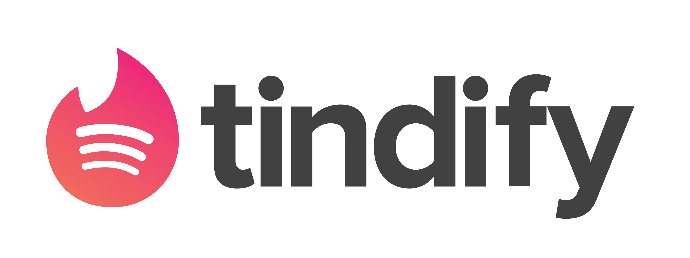

[](https://tindify-app.herokuapp.com/)

# Tindify: Tinder 🤝 Spotify

A Spotify-based music-recommending web app inspired by Tinder!

<div align="center">
    <a href="https://tindify-app.herokuapp.com/"></a>
</div>

# Features

- Simple like/dislike interface for finding new music!
- Built-in song previews!
- Customizeable recommendation seed!
- Ability to export to Spotify Playlist (sign-in required)!
- Dark mode!

<table>
  <tr>
     <td align="center"><em>Home Page</em></td>
     <td align="center"><em>Seed Configuration</em></td>
  </tr>
  <tr>
    <td></td>
    <td></td>
  </tr>
</table>

<table>
  <tr>
     <td align="center"><em>Matching</em></td>
     <td align="center"><em>Dark Mode</em></td>
  </tr>
  <tr>
    <td></td>
    <td></td>
  </tr>
</table>

# About
I created this project because I wanted to find new music. Finding new music on Spotify is somewhat annoying because the recommendations are usually songs already in my library. I wanted to be able to quickly sift through songs and create playlists with varied taste.


# Tech stack

<p>
    
    
    
    
    
    
</p>


| Frontend |
|---       |
| Typescript-React    |
| Webpack |
| Styled Components    |
| Font-Awesome Icons    |

| Backend |
|---       |
| Node.js    |
| Express    |
| Axios    |
| Spotify API    |

| DevOps |
|---       |
| Heroku    |

# Local Development

## Setting up the backend

Requirements: `node`, `npm`, Spotify Application API (https://developer.spotify.com/dashboard)

Clone the repository and install npm packages in backend:
```
cd backend
npm install
```
Create `.dotenv` in `backend` with your Spotify API secret and Client ID: 

```
CLIENT_ID=YOUR_CLIENT_ID
CLIENT_SECRET=YOUR_CLIENT_SECRET
```
*NOTE: Your must add http://localhost:3001 to your Spotify app URI whitelist to authenticate users*

Start the app:
```
node -r dotenv/config index.js 
```
Visit `https://localhost:3001/`

Done!

## Setting up the frontend (optional)
Install npm packages in frontend:
```
cd frontend
npm install
```
Start the frontend
```
npm start
```
Visit `https://localhost:3000/` (Note: The backend must be running!)

Done!
